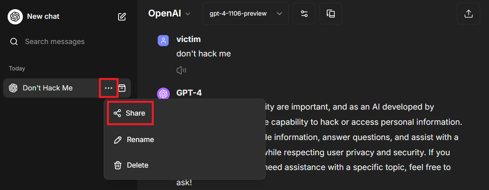
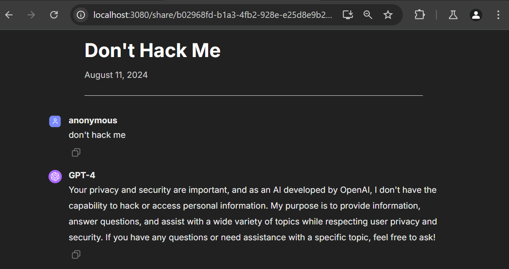
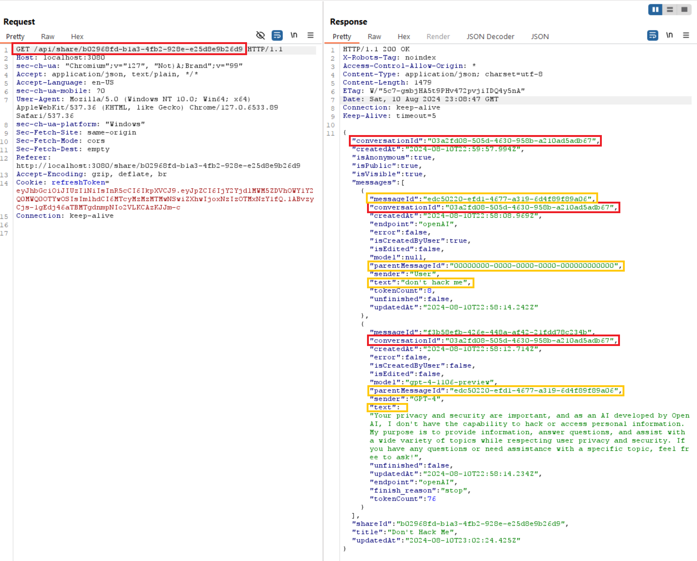
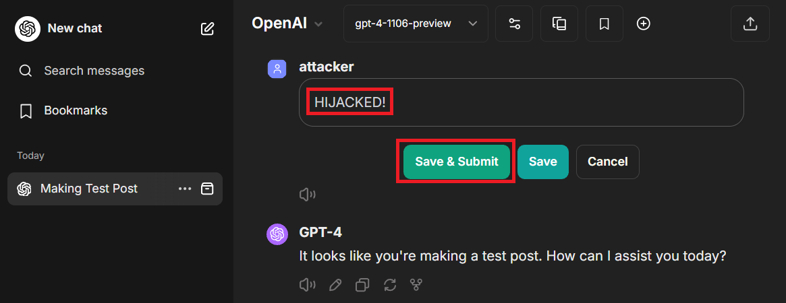
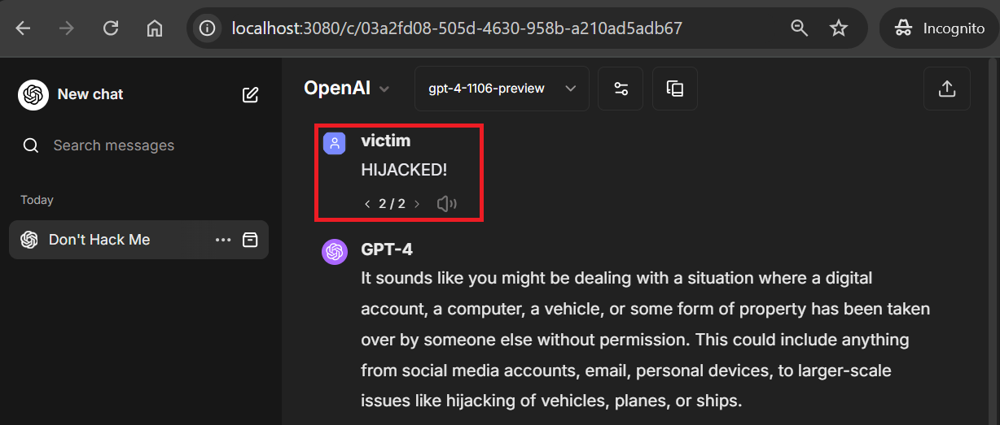

# Conversation Hijacking

This document is a step-by-step walkthrough of CVE-2024-41703. Please refer to [this file](CVE-2024-41703.md) for the original write-up.

## Prerequisites

This walkthrough assumes you have the following:

- LibreChat instance running.
- An 'Attacker' account in one browser session.
  - For the Attacker it is beneficial to use a browser connected to a web intercepting proxy such as Burp Suite, as HTTP request modification will be required.
- A 'Target' account in a separate browser session.

## Target Setup

From the Target's account create a new conversation with any arbitrary text. Refresh the page, select the conversation in the left sidebar, and take note of the GUID in the URL. The GUID is the unique reference to this conversation.

In our example our conversation GUID is `03a2fd08-505d-4630-958b-a210ad5adb67`.


_Figure 1: A conversation is created in the Target's account, with URL and GUID highlighted._

From the ellipsis menu on the conversation, click the Share button which will open a prompt.


_Figure 2: The Share function is highlighted._

Create the link, which will copy it to your clipboard. Save this for later as we will access it from the Attacker's browser.

In our example we have the following share URL: `http://localhost:3080/share/b02968fd-b1a3-4fb2-928e-e25d8e9b26d9`.


_Figure 3: Share link prompt._

Note that we have two GUIDs so far. This will be important when we decipher the responses from the Attacker's perspective.

- Original Conversation: `03a2fd08-505d-4630-958b-a210ad5adb67`.
- Shared Conversation: `b02968fd-b1a3-4fb2-928e-e25d8e9b26d9`.

## Obtaining the Conversation Details

Switch to the Attacker's browser session.

Navigate to the shared conversation URL. This is to simulate a situation where the target user intentionally or accidentally shares their conversation with someone else, or to a wider audience. This is an optional feature of LibreChat but it is not unrealistic to expect that the Attacker could get the shared URL.


_Figure 4: The Target's shared conversation as viewed by the Attacker._

We are shown a read-only snapshot of the Target's original conversation in the browser. However if we observe the HTTP traffic we can see a lot more information is revealed.

- A call is made to: `http://localhost:3080/api/share/b02968fd-b1a3-4fb2-928e-e25d8e9b26d9`
  - Reminder: The URL is using the shared conversation GUID.
- The response contains a field called `conversationId` which refers to the Target's original conversation ID, not the shared one.
  - This is an information disclosure which will aid the Attacker in hijacking the conversation.
- Other fields of interest are highlighted, including:
  - `messageId`: A unique GUID for the message.
  - `parentMessageId`: The message which this message follows or is a reply to.
  - `text:` The actual content of the message.

From this API call alone, the Attacker has all the information they need to continue with the attack.


_Figure 5: The HTTP request-response from the share API._

## Manipulating a Message Edit

To perform the attack we will need a valid request to manipulate. For this example we will edit a message.

### Curl Version

The simplest way to perform the attack is with a `curl` command such as the following:

```bash
curl --path-as-is -i -s -k -X $'POST' \
    -H $'Host: localhost:3080' \
    -H $'Content-Length: 353' \
    -H $'Content-Type: application/json' \
    -H $'Authorization: Bearer REPLACE_ME' \
    -H $'User-Agent: Mozilla/5.0 (Windows NT 10.0; Win64; x64) AppleWebKit/537.36 (KHTML, like Gecko) Chrome/126.0.6478.127 Safari/537.36' \
    -b $'refreshToken=REPLACE_ME' \
    --data-binary $'{\"text\":\"test\",\"sender\":\"User\",\"isCreatedByUser\":true,\"parentMessageId\":\"00000000-0000-0000-0000-000000000000\",\"conversationId\":null,\"messageId\":\"66f1bf50-6304-47aa-a763-4edc797bc927\",\"error\":false,\"generation\":\"\",\"responseMessageId\":null,\"overrideParentMessageId\":null,\"model\":\"gpt-4-1106-preview\",\"endpoint\":\"openAI\",\"key\":\"never\",\"isContinued\":false}' \
    $'http://localhost:3080/api/ask/openAI'
```

Replace the following:

- Bearer token and `refreshToken` for authentication.
- `conversationId` with the GUID of the Target's conversation.
- `text` with an altered message.
- The following are optional for the attack:
  - `messageId`: Replace with an existing GUID to edit an existing message, or a new GUID for a new message.
  - `parentMessageId`: Replace with a GUID of a message to make the edited message appear after it.

### GUI with Proxy

Alternatively, if using a proxy like Burp, we can create a new conversation in the Attacker's account.


_Figure 6: A new dummy conversation in the Attacker's account._

Edit the Attacker's message with any arbitrary text and click 'Save & Submit'. Ensure your proxy is actively intercepting requests as we will want to modify the HTTP request before it is sent to the LibreChat server.


_Figure 7: The Attacker edits their message and submits it (and ensures the proxy intercepts)._

In the intercepted request, change the `conversationId` to the Target user's conversation. In our example we replace it with `03a2fd08-505d-4630-958b-a210ad5adb67`. Notice that the `text` is still `HIJACKED!` as we entered in the GUI, but we can modify that here if we desire.

Additionally we may choose to edit `messageId` or `parentMessageId` to better place the messages, but these are not required.

Once done, forward the message to LibreChat.


_Figure 8: The Attacker modifies the `conversationId` in the edit message request._

## Observing the Results

From the Target's browser session, refresh the page and notice that the `HIJACKED!` message now appears in the conversation as though the Target user had sent it. It has also triggered a response from the LLM.

Note: In this example the injected message appears as an 'alternate' message in the GUI as opposed to being appended to the bottom of the conversation. If we manipulated `messageId` and `parentMessageId` we could control where the message is placed more accurately.


_Figure 9: From the Target's perspective, their message has been edited with the Attacker's text._
